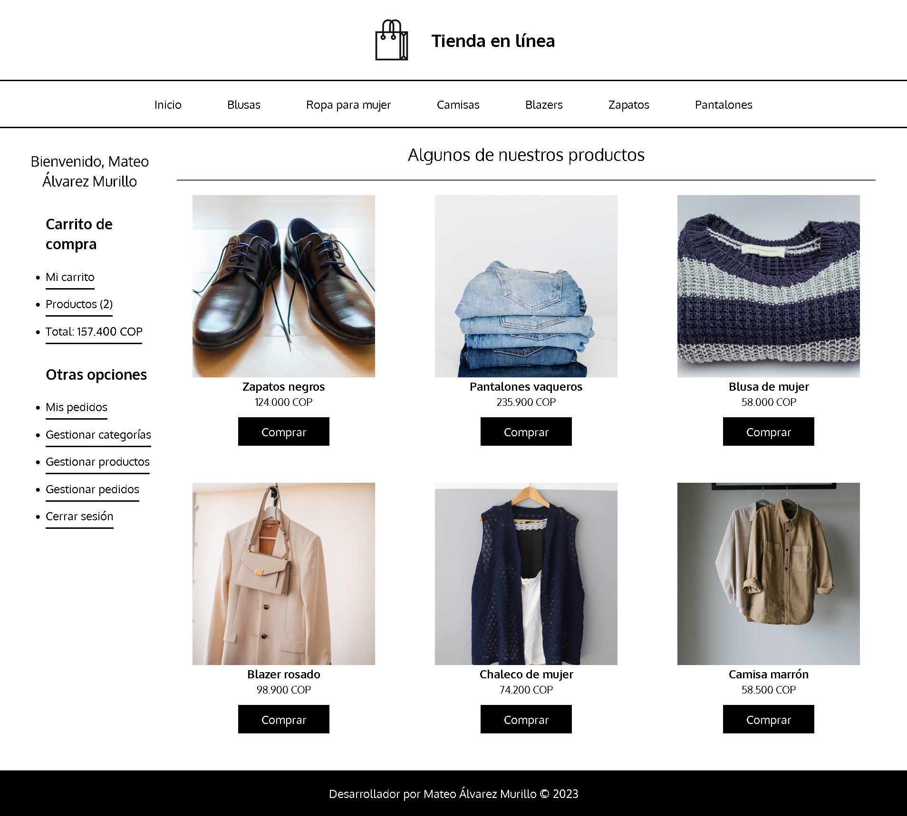
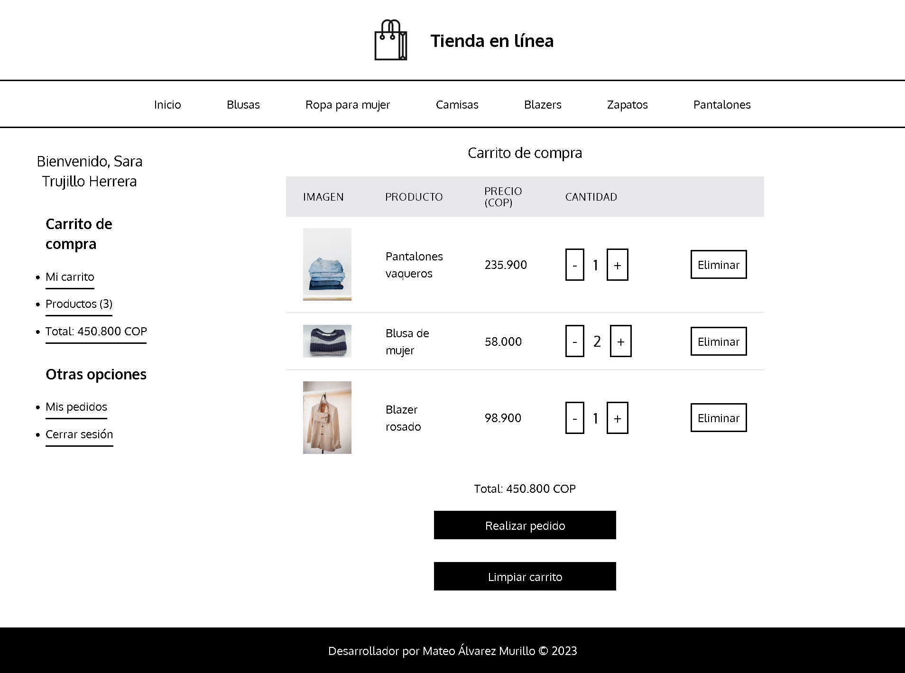
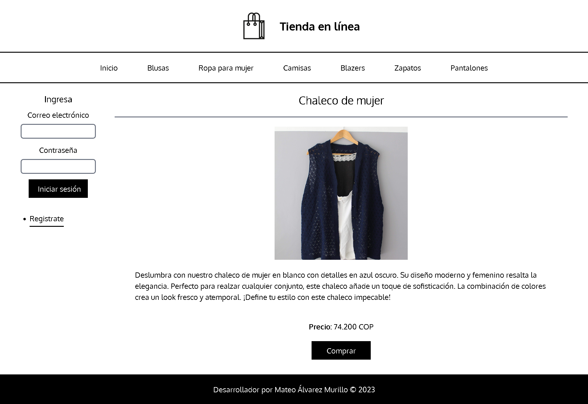

# Tienda en línea

El propósito de este proyecto es recrear una tienda en línea de ropa donde los usuarios puedan registrarse, iniciar sesión, agregar productos a su carrito de compras y realizar pedidos. El proyecto está desarrollado con PHP, MySQL y Tailwind CSS.

## Funcionalidades

_Registro e Inicio de Sesión Seguros:_ Se implementó encriptación de contraseñas y medidas de seguridad contra ataques de SQL injection para garantizar la integridad de los datos de los usuarios.

_Carrito de compras:_ Los usuarios podrán una vez iniciada la sesión agregar productos a su carrito de compras, donde también podrán eliminar productos del mismo o aumentar o disminuir la cantidad de productos que desean comprar.

_Pedidos:_ Los usuarios podrán realizar pedidos de los productos que tengan en su carrito de compras, donde se les mostrará un resumen de su pedido y podrán elegir la dirección de envío.

_Administración:_ Los administradores podrán agregar, editar y eliminar productos de la tienda, editar y agregar categorías, así como también podrán ver los pedidos realizados por los usuarios y cambiar su estado.

## Vista previa



## Comenzando 🚀

1. Clona este repositorio en tu máquina local o descargar la carpeta comprimida del proyecto:

   ```bash
   git clone https://github.com/drifterDev/online-store.git
   ```

### Prerrequisitos 

Antes de comenzar, asegúrate de tener instalado `npm` en tu sistema. Si no lo tienes instalado, puedes descargarlo e instalarlo desde [el sitio web oficial de Node.js](https://nodejs.org/).

También necesitarás tener instalado `composer` en tu sistema. Si no lo tienes instalado, puedes descargarlo e instalarlo desde [el sitio web oficial de Composer](https://getcomposer.org/).

Además, ten en cuenta que para ejecutar este proyecto de manera completa, necesitarás tener PHP y un servidor MySQL configurado en tu entorno de desarrollo. Asegúrate de que tu servidor PHP esté funcionando correctamente y que tengas acceso a una base de datos MySQL para que todas las funcionalidades del proyecto se ejecuten sin problemas.

**Recomendación:** Para facilitar la configuración de un servidor PHP y MySQL en tu entorno de desarrollo, recomiendo utilizar XAMPP, una solución todo en uno que incluye Apache (para PHP) y MySQL en un solo paquete. Puedes descargar XAMPP desde [el sitio web oficial de XAMPP](https://www.apachefriends.org/index.html). Esto simplificará la configuración y te permitirá comenzar rápidamente con tu proyecto.

### Instalación 🔧

1. Descargar las dependencias necesarias del proyecto:

   ```bash
   npm install
   ```

2. Ejecutar el comando para compilar los archivos de Tailwind CSS:

   ```bash
   npm run build
   ```

3. Configurar la conexión a la base de datos en el archivo `config/Database.php`:

   ```php
   define("SERVER", "localhost");
   define("DATABASE", "nombre_de_la_base_de_datos");
   define("USERNAME", "tu_usuario");
   define("PASSWORD", "tu_contraseña");
   ```

4. Ejecutar el script SQL `database/database.sql` en tu servidor MySQL para crear la base de datos y las tablas necesarias para el proyecto (Recuerda cambiar el valor de nombre_de_la_base_de_datos).

5. Ejecutar el comando para cargar composer y las dependencias necesarias:

   ```bash
   composer install
   composer dump
   ```
## Iniciar el proyecto

1. Abre el panel de control de XAMPP y asegúrate de que los servicios de Apache y MySQL estén "Running" (ejecutándose). Si no lo están, haz clic en los botones "Start" junto a esos servicios para iniciarlos.

2. Coloca este proyecto en el directorio `htdocs` de XAMPP. Por defecto, el directorio `htdocs` se encuentra en la carpeta de instalación de XAMPP.

3. Abre tu navegador web y accede al proyecto utilizando la URL `http://localhost/nombre_del_proyecto`. Reemplaza "nombre_de_tu_proyecto" con la carpeta o ruta relativa donde esté el proyecto dentro del directorio `htdocs`. Por ejemplo, si el proyecto está en `C:\xampp\htdocs\proyecto`, debes acceder a `http://localhost/proyecto`.

## Iniciar el proyecto si lo anterior no funciona

1. Verificar que la siguiente línea este descomentada de `httpd.conf` del servidor apache

   ```bash
   # Virtual hosts
   LoadModule vhost_alias_module modules/mod_vhost_alias.so

   ```

2. Acceder a la carpeta de instalación de xamp e ir a la carpeta `apache/conf/extra/httpd-vhosts.conf` y agregar lo siguiente:

   ```bash
   <VirtualHost *:80>
       DocumentRoot "C:\xampp\htdocs\nombre_del_proyecto\public"
       ServerName nombre_del_proyecto.localhost
       <Directory "C:\xampp\htdocs\nombre_del_proyecto\public">
           DirectoryIndex index.php
           Options Indexes FollowSymLinks
           AllowOverride All
           Require all granted
        </Directory>
   </VirtualHost>
   ```

3. Ya apache reconoce la url, pero para que el navegador también lo reconozca hay que acceder a la siguiente ruta `C:\Windows\System32\drivers\etc` y editar el archivo `hosts` agregando la siguiente línea:

   ```bash
   127.0.0.1 nombre_del_proyecto.localhost
   ```

4. Abrir el navegador web y acceder al proyecto utilizando la URL `http://nombre_del_proyecto.localhost`.

## Construido con 

* [Tailwind CSS](https://tailwindcss.com/) - El framework CSS utilizado
* [MySQL](https://www.mysql.com/) - Gestor de base de datos
* [PHP](https://www.php.net/) - Lenguaje de programación utilizado en el backend

## Más vistas previas





## Contribuyendo 

Aprecio cualquier sugerencia para mejorar el contenido de este proyecto. Si deseas contribuir, por favor crea un "issue" en el repositorio o contáctame directamente. Valoraré tus aportes para mejorar este repositorio.

## Licencia proyecto

Los códigos incluidos en este proyecto están bajo la Licencia MIT. Para obtener más información, consulta el archivo [LICENSE](LICENSE) en la raíz del repositorio.

## Licencia de terceros

Las imágenes utilizadas en este proyecto han sido obtenidas de Pexels.com, un sitio web que ofrece fotos de alta calidad de dominio público sin restricciones de licencia. Aunque no es necesario dar atribución en muchos casos, quiero reconocer y agradecer a la comunidad de Pexels por proporcionar recursos visuales gratuitos.

Para obtener más información sobre la licencia de las imágenes específicas utilizadas en este proyecto, consulta las políticas de licencia en el sitio web de Pexels: [Pexels License](https://www.pexels.com/license/).
